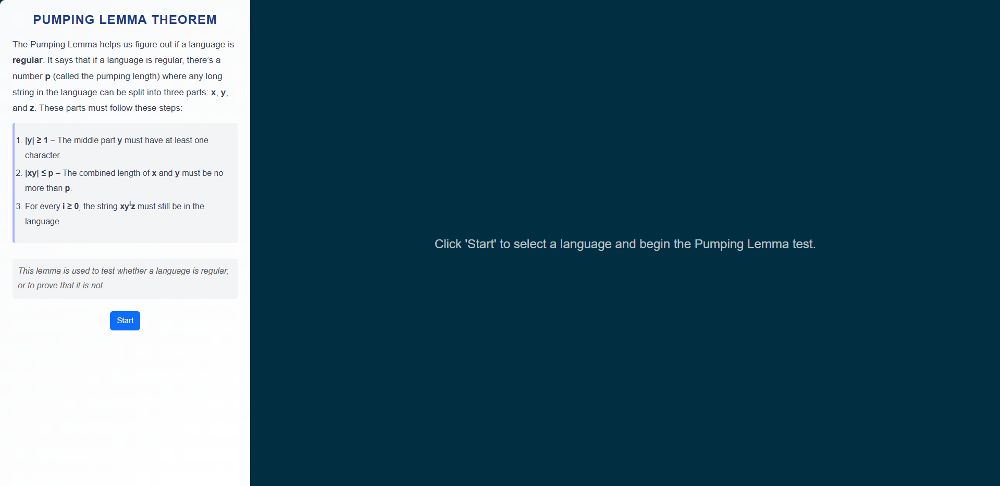
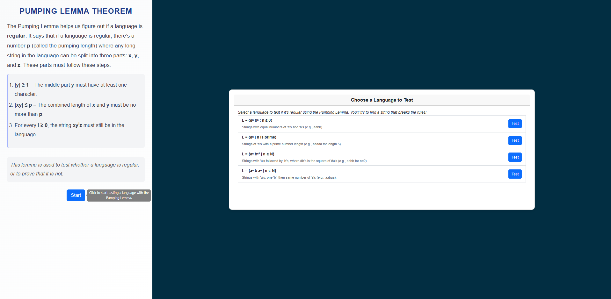
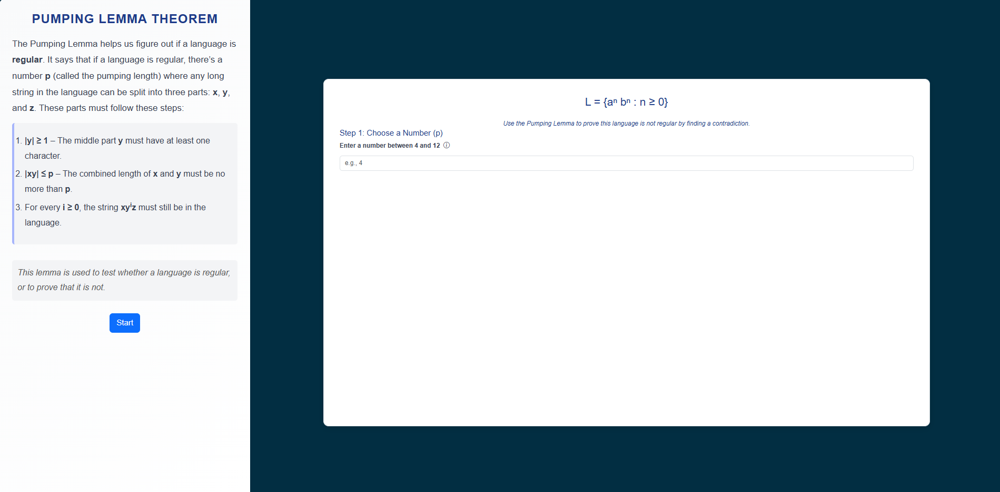
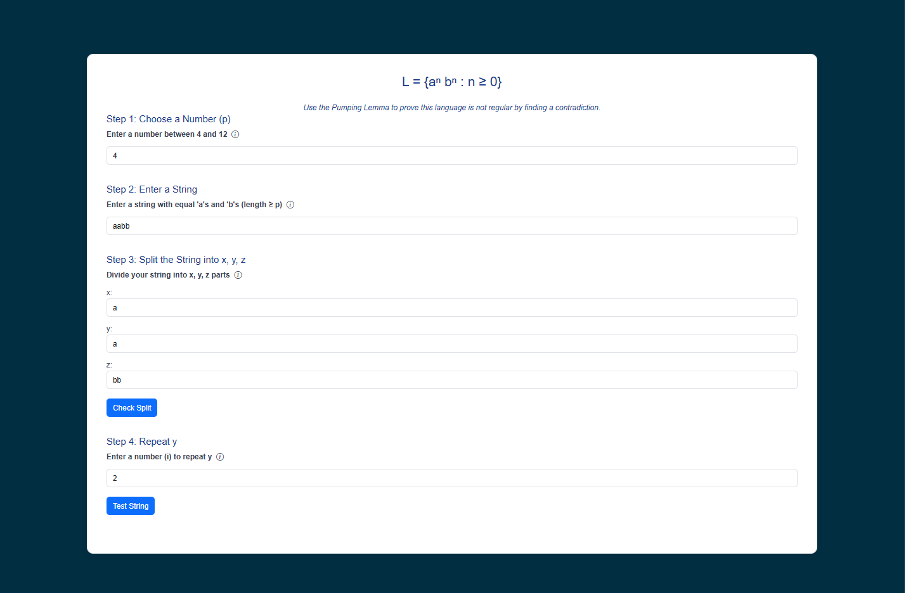
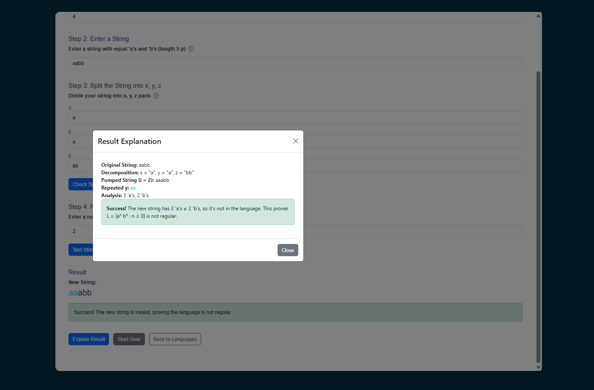

#### Step 1 – Click Start  
Click on the **Start** button to begin the Pumping Lemma simulation.  
  

#### Step 2 – Select an Example  
Choose a language example from the list (e.g., `L = {aⁿbⁿ : n ≥ 0}`) and click the **Test** button to proceed.  
  

#### Step 3 – Choose Pumping Length (p)  
Enter a number **p** (pumping length) within the allowed range, as shown in the instructions.  
This value will be used to split the string into three parts.  
  

#### Step 4 – Enter String and Values  
Provide the following inputs:  

- **String (s):** Enter a string from the language with length ≥ p.  
- **Decomposition (x, y, z):** Split the string into three parts following the Pumping Lemma conditions.  
- **Value of i:** Enter a number to repeat the substring **y** *i* times.  

  

#### Step 5 – View the Result  

After pumping the string, the tool displays the result explanation:

- **Original String:** The input string chosen earlier.  
- **Decomposition:** How the string is split into `x`, `y`, and `z`.  
- **Pumped String:** The new string after repeating `y` *i* times.  
- **Analysis:** Checks whether the new string still belongs to the language.  

#### Result Cases  
- **If it is Success:**  
  The pumped string does not belong to the language, so a contradiction is found.  
  This proves that the given language is **not regular**.  

- **If it is Not Success:**  
  The pumped string is still valid, so no contradiction is found.  
  Try another split or a different value of *i* to test again.  

